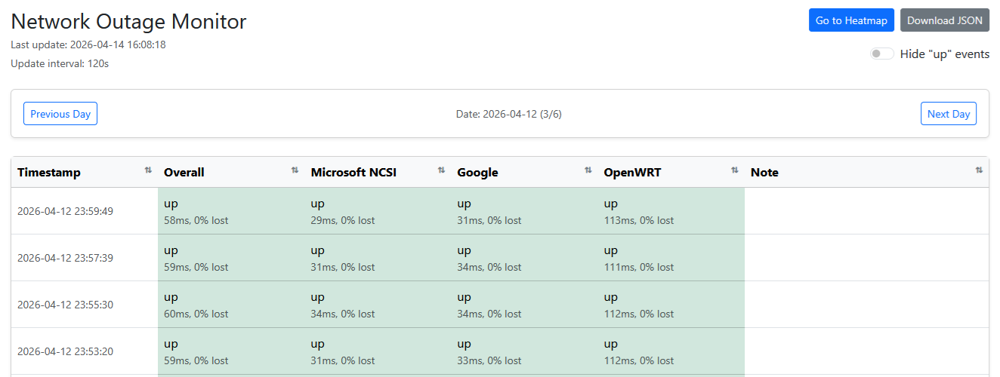
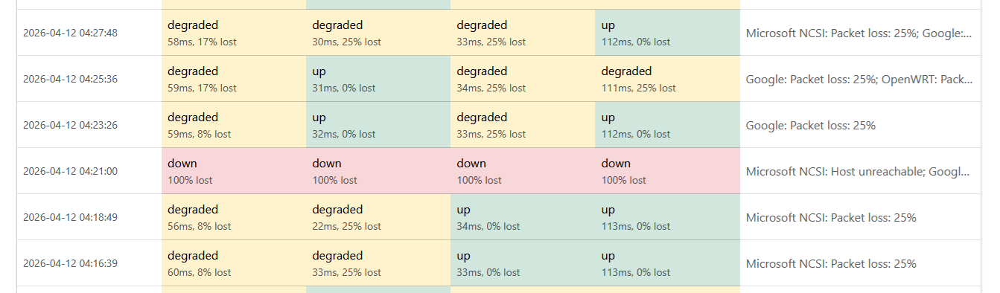
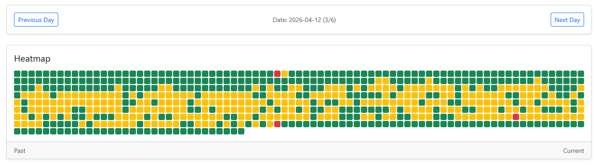

<h2 align="center">network-outage-monitor (nom)</h2>

    A simple way to monitor and track home network outages. Born out of necessity and my ISP's unwillingness to accept that the service I pay for and expect is sub-par.

<h3>Running</h3>
Standalone: <code>python3 tracker.py</code> 
Dockerized: <code>docker compose up --build -d</code>

<h3>Configuration</h3>
<b>Note:</b> I plan on creating a configuration file so these variables can be changed without modifying any scripts</b> 
<table>
  <tr>
    <th>Setting</th>
    <th>File</th>
    <th>Default / Value</th>
    <th>Description</th>
  </tr>

  <tr>
    <td><code>hosts</code></td>
    <td><code>tracker.py:13</code></td>
    <td>Microsoft NCSI, Google, OpenWRT</td>
    <td>The services to ping.</td>
  </tr>

  <tr>
    <td><code>PING_INTERVAL</code></td>
    <td><code>tracker.py:20</code></td>
    <td>120</td>
    <td>Every X seconds the application will take a reading.</td>
  </tr>

  <tr>
    <td><code>DEGRADED_LATENCY_MS</code></td>
    <td><code>tracker.py:21</code></td>
    <td>500</td>
    <td>Mark the service as degraded if a ping takes more than this many milliseconds.</td>
  </tr>

  <tr>
    <td><code>DEGRADED_PACKET_LOSS</code></td>
    <td><code>tracker.py:22</code></td>
    <td>0</td>
    <td>More than X percent packet loss marks the service as degraded.</td>
  </tr>

  <tr>
    <td><code>app.run</code></td>
    <td><code>tracker.py:130</code></td>
    <td>(host="0.0.0.0", port=5000, debug=False)</td>
    <td>
      Address and port to run on. <b>NOTE:</b> If changed and using Docker, update <code>ports:</code> in <code>docker-compose.yml</code>.
    </td>
  </tr>

  <tr>
    <td><code>TZ</code></td>
    <td><code>docker-compose.yml:9</code></td>
    <td>America/New_York</td>
    <td>Timezone for accurate reporting.</td>
  </tr>

  <tr>
    <td><code>maxCells</code></td>
    <td><code>static/script.js:174</code></td>
    <td>720</td>
    <td>Number of heatmap cells (720 = 24 hours at 2-minute intervals).</td>
  </tr>
</table>

<h3>Features</h3>
<ol>
    <li>Lightweight Bootstrap Web Panel.</li>
    
    <li>ICMP Ping X hosts every X minutes, retrieve data about packet loss and latency.</li>
    
    <li>Heatmap</li>
    
    <li>JSON Data</li>
    <pre><code>{
    "timestamp": "2026-04-09 19:27:43",
    "overall_status": "degraded",
    "hosts": {
      "Microsoft NCSI": {
        "status": "degraded",
        "reason": "Packet loss: 50%",
        "latency_ms": 34,
        "packet_loss": 50
      },
      "Google": {
        "status": "degraded",
        "reason": "Packet loss: 25%",
        "latency_ms": 26,
        "packet_loss": 25
      },
      "OpenWRT": {
        "status": "down",
        "reason": "Host unreachable",
        "latency_ms": null,
        "packet_loss": 100
      }
    },
    "note": "Microsoft NCSI: Packet loss: 50%; Google: Packet loss: 25%; OpenWRT: Host unreachable"
  }
</code></pre>
</ol>
